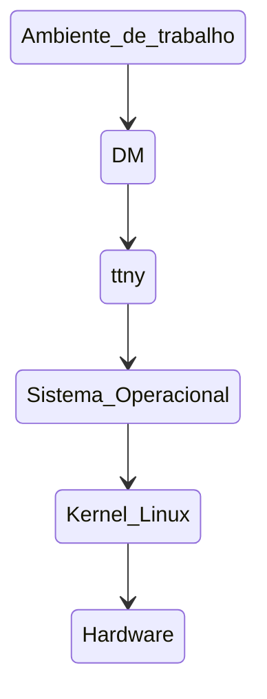

# CAP 2.2 Terminais Virtuais

## Estrutura do Sistema Operacional

Para compreender de fato o que é esse sistema , é fundamental saber do que se trata cada uma de suas camadas. Vejamos:

 

* **Ambiente de Trabalho** - 

* **DM (display manager)** - Interface Grafica de Logins

* **ttyn** - Terminais Virtuais que imterpretam os comandos introduzidos pelo usuario

    `OBS : Linux tem 63 terminais virtuais, e apenas 6 são disponibilizados para o usuario `

* **Sistema Operacional** - Camada que auxilia e ospeda todos os aplicativos das camadas superiores

* **Kernel Linux** -  Faz a mediação hardware e Sistema Operacional

* **Harware** - é tudo aquilo que tem a mão do usuario em comunicação direta com o Sistema Operacional

`OBS: Bash é o interpretador padrão do Linux`

