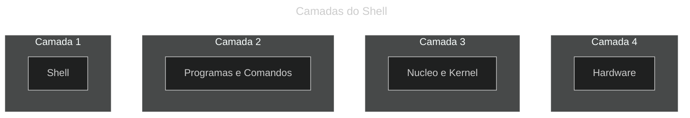

# CAP 2.4 Shell e variaveis locais

## O que é um Shell

Há diversos tipos de shell disponiveis para distribuições GNU/Linux.

* **sh (Bourne shell)**
* **bash (Bourne Again shell)**
* **csh (C shell)**
* **tcsh (Turbo C shell)**
* **ksh (Korn shell)**
* **zsh (Z shell)**

## Camadas do Shell

* **Shell**

* **Programas e comandos**

* **Nucleo ou Kernel**

* **Hardware**



## Tipos da variveis

* **Variaveis Locais** - São as variaveis que estão disponiveis apenas para o shell atual

* **Varaiveis de Ambiente** - São as variaeis que podem ser acessadas em todo ambiente do seu Sistema Operacional, segue algumas variaveis de ambiente

    * `$PATH`
    * `$PS1`
    * `$PS2`
    * `$MAIL`
    * `$LOGNAME`
    * `$OSTYPE`

## Criação de Variavel Global e Local

### Global
```bash
export GLOBAL="Como export na frente"
```
### Local
```bash
LOCAL="sem export na frente"
```


