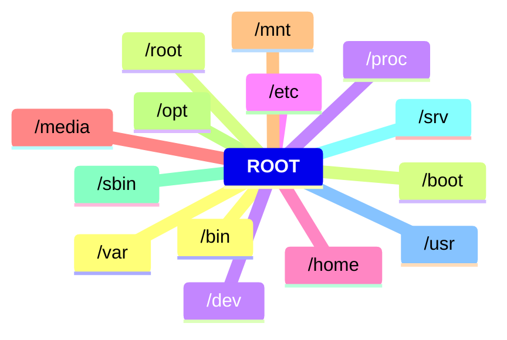

# CAP 04.01 Estrutura de Arquivos

## Definição para cada diretorio

* **/bin** - Binarios essencias do usuario
* **/boot** -  arquivos estaticos do boot
* **/dev** - arquivos de dispositivos (devices)
* **/etc** - Arquivos de configuração não especificados
* **/home** - Pastas dos usuarios comnus do sistema
* **/media** - Ponto de montagem temporario para mídias removivéis
* **/mnt** - Ponto de montagem temporario para midias removiveis
* **/opt** - Software adicionais(adicionados pelos usuarios)
* **/sbin** - Binarios do Sistema
* **/srv** - Dados para serviços providos pelo sisitema
* **/usr** - arquivos temporarios
* **/var** - multi-usuários utilitarios e aplçicações
* **/root** - Home do superusuario
* **/proc** - Sistema de arquivos virtual, documentos do kernel e status de processos como arquivos
